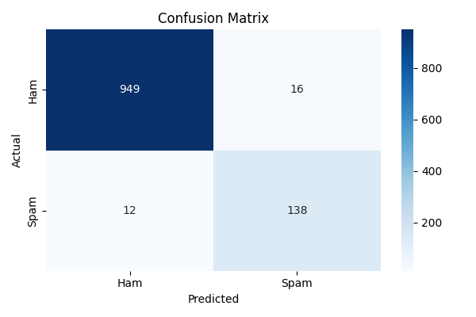
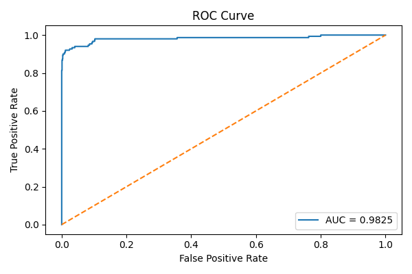

# 📧 Spam–Ham Classifier  

A complete **Machine Learning + NLP** project to classify messages as **Spam** or **Ham**. The project includes **data preprocessing**, **Bag of Word vectorization**, **training multiple ML models**, **model comparison**, **ROC & confusion matrix plots** and **Streamlit deployment**.

---

## 📘 1. Project Overview

- Classifies SMS/Email messages as spam or ham.  
- Preprocessing includes: cleaning text, removing stopwords, tokenization.  
- Converts text into numerical features using **Bag of Word vectorization**.  
- Trains multiple machine learning models and evaluates them using **cross-validation**.  
- Selects the best-performing model automatically.  
- Provides visualizations: Confusion Matrix, ROC Curve.  
- Deployable via **Streamlit** for interactive prediction.

---


---

## 🔄 2. Pipeline Workflow

1. **Load Dataset** → `preprocessing/load_data.py`  
2. **Clean Text** → `preprocessing/clean_text.py`  
3. **Vectorization (BOW)** → `preprocessing/vectorize.py`  
4. **Train Multiple Models** → `preprocessing/train.py`  
5. **Evaluate Models** → `preprocessing/evaluate.py`  
6. **Select Best Model & Save** → `models/best_spam_model.pkl` + `models/vectorizer.pkl`  
7. **Visualize Metrics** → Confusion Matrix, ROC 
8. **Deploy with Streamlit** → `app.py`

---

## 📊 3. Models Used & Comparison

| Model | Cross-Validated Accuracy |
|-------|-------------------------|
| Multinomial Naive Bayes | 0.9758 |
| K-Nearest Neighbors | 0.9026 |
| Gradient Boosting | 0.9589 |
| AdaBoost | 0.9147 |

## 🏆 4. Best Model
**Multinomial Naive Bayes**  

Saved as: `models/best_spam_model.pkl`

---

## 📈 5. Evaluation Metrics & Graphs

Metrics calculated for test data:

- **Accuracy : 0.9749**  
- **Precision : 0.8961**  
- **Recall : 0.9200**  
- **F1 Score : 0.9079**  

**Visualizations Saved in `reports/plots/`:**

1. **Confusion Matrix**
<div align="center">
  
</div>

2. **ROC Curve**
<div align="center">
  
</div> 

---

## 🛠️ 6. Installation

```bash
# Clone the repo
git clone https://github.com/roshan-acharya/SpamClassifier
cd SpamClassifier

# Create virtual environment (optional)
python -m venv venv
source venv/bin/activate  # Linux/macOS
venv\Scripts\activate     # Windows

# Install dependencies
pip install -r requirements.txt

```

## 🔄 7. Running the Project
- Run Training Pipeline

    ```bash
    python pipeline/pipeline.py
    ```

- Run Streamlit App
    ```bash
    streamlit run app.py
    ```


## 🧰 8. Tech Stack


- Python

- Pandas

- NumPy

- Scikit-learn

- Matplotlib, Seaborn

- Streamlit

- Pickle (for saving models)


## 👨‍💻 9. Author

**Roshan Acharya**  
*AI/ML Enthusiast*  


